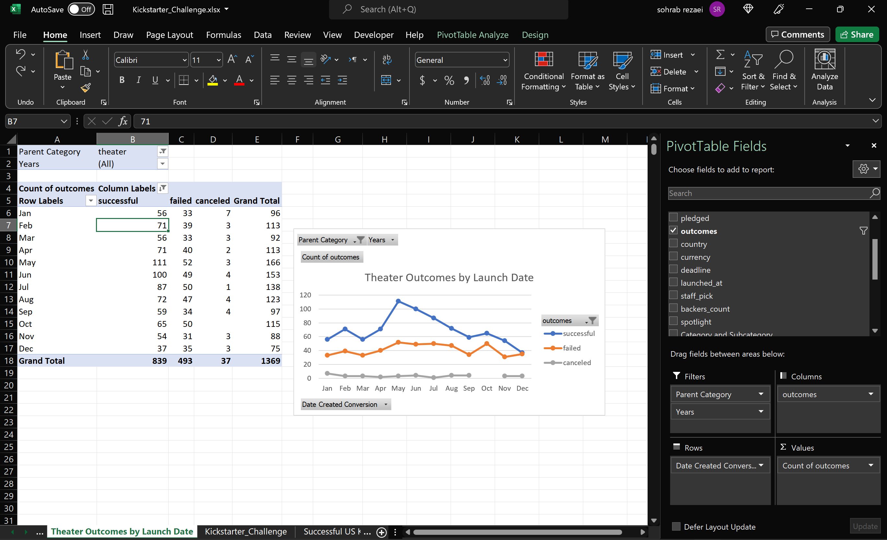

# Kickstarter-Analysis
## Overview of Project
Louise has asked us to analyze various fundraisings to understand better the factors involved in launching a campaign for herself.
### Purpose
After going over multiple factors related to launching the campaign, now she has decided to emphasize finding the relationship between the aftermath of these campaigns based on the month that they were established and the amount of money they were supposed to attain.
## Analysis and Challenges
Since there are two different projects, we basically breakdown the analyses into two sections.
### Analysis of Outcomes Based on Launch Date
In the new KickStarter_Challenge worksheet, we have created a new column named Years. The values of the column are extracted from the date created conversion column by using [Year Function Syntax](https://support.microsoft.com/en-us/office/year-function-c64f017a-1354-490d-981f-578e8ec8d3b9) .
Then I created a pivot table and named the new sheet 'Theater Outcomes by Launch Date'. I put the Parent Category and Years in the filter section, date created conversion in the rows sections and outcomes in both the column and values section. I removed the years and quarters field from the rows sections to show only months in my pivot table. I changed the Parent Category filter to Theater only and by clicking the column labels section I managed to filter the live and blank out of my dataset. I also used descending order to show the successful outcome in the first column. Finally, I inserted a line with markers chart and chose a suitable title to demonstrate my project. 

